# Liquid functionality in Wasm-IoT

## Migration sequence

```mermaid
%%{ init : { "theme" : "default", "flowchart" : { "curve" : "linear" }}}%%
flowchart LR
    %% Definitions.
    S1((S1))
    S2((S2))
    S3((S3))
    O[/O\]

    %% Arrows. Note the order for a better supervisors-first-row layout.
    S3-- "❌" ---xS1
    S1-- "💦⚙️" --->S2
    O--  "✅" --->S2
    S3-- "❓" --->O
    S1-- "⚠️" --->O
```

Explanations for the actions in the (expected) order of events (with some open questions about the details):

- ⚠️: _Supervisor1_ (`S1`) shuts down graciously for example due to _Orchestrator_'s (`O`)
  request or a computation-performance-based rule placed on the supervisor itself.
    - How does the _Orchestrator_ get the message about the upcoming migration (in the computation-performance-based rule case)?
    - And how does the _Supervisor1_ get the _Orchestrator_'s request?
    - Simple HTTP messages with appropriate endpoints?
- 💦⚙️: _Supervisor1_ __migrates__ its modules' files and execution state to _Supervisor2_ (`S2`).
    - How does _Supervisor1_ find out about _Supervisor2_?
    - Some communication from the _Orchestrator_?
    - Will the migration go directly from _Supervisor1_ to _Supervisor2_? Or through the _Orchestrator_ somehow?
- ✅: _Orchestrator_ acknowledges the migration and reconfigures the associated
  deployments according to this change.
- ❌: _Supervisor3_ (`S3`) tries to connect to Supervisor1 but it is no longer available
  (having shut down).
- ❓: _Supervisor3_ queries orchestrator about the incident and _Orchestrator_
  "reroutes" _Supervisor3_ to make requests it depends on to _Supervisor2_
  instead from now on.

### Supervisor connection failure

```mermaid
%%{ init : { "theme" : "default", "flowchart" : { "curve" : "linear" }}}%%
flowchart LR
    %% Definitions.
    S1((S1))
    S2((S2))
    S3((S3))
    O[/O\]

    %% Arrows.
    O--  "❌ 1" ---xS1
    O--  "✅ 1" --->S2
    S3-- "❌ 2" ---xS1
    S3-- "❓" --->O
    S3-- "✅ 2" --->S2
```

- ❌ 1: _Supervisor1_ (`S1`) crashes or loses network connection
    - _Orchestrator_ finds out about the failure based on period health checks? (Or some other way?)
- ✅ 1: _Orchestrator_ (`O`) migrates all the deployments from _Supervisor1_ (`S1`) to _Supervisor2_ (`S2`) which has similar capabilities.
    - Files uploaded directly to _Supervisor1_ and its execution state are lost unless there is some periodic fail safe which stores those to some place where the _Orchestrator_ (and _Supervisor2_) can access them.
- ❌ 2: _Supervisor3_ (`S3`) tries to connect to Supervisor1 but it is no longer available (having shut down).
- ❓: _Supervisor3_ queries orchestrator about the incident and _Orchestrator_
  "reroutes" _Supervisor3_ to make requests it depends on to _Supervisor2_
  instead from now on.
- ✅ 2: _Supervisor3_ can successfully use the service previous executed by _Supervisor1_ using _Supervisor2_ instead.
