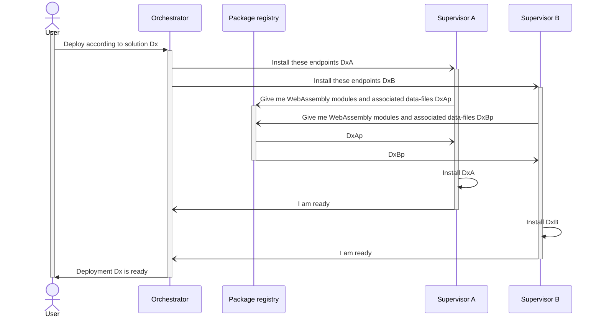
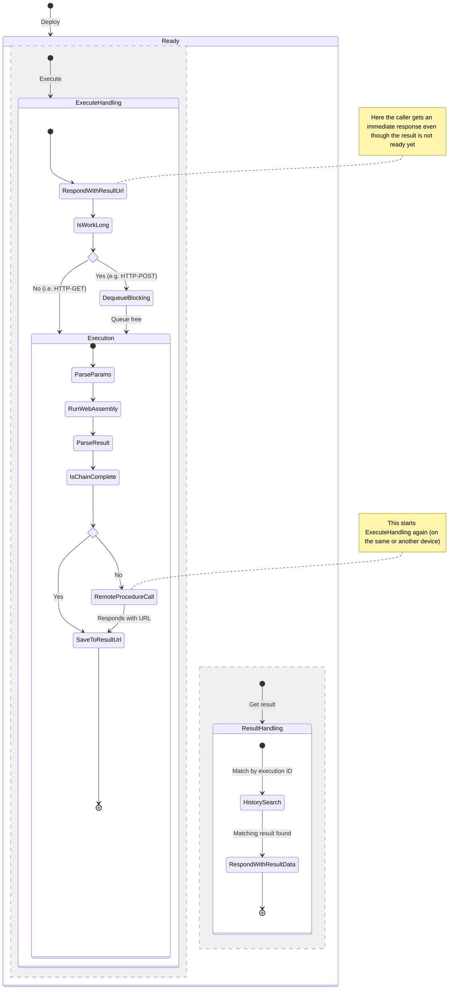

# Deployment

Deployment and managing the distributed application state during runtime is
pretty much the central point of why this system, orchestration, exists.

In this system specifically, the word 'deployment' is used to refer to two things:

1. 'Deploying' or in other words the __action__ of setting up of Wasm-modules and
associated execution environments.
2. The state when different execution environments reside on devices and
supervisors have exposed endpoints of WebAssembly functions, creating together
a network of communication between themselves. The orchestrator is in charge of
monitoring and managing the state in order to keep the overarching service or
desired application functional.

These two things or stages are based on resources (i.e., devices, modules and
their associated descriptions) that are available to the orchestrator. A user
selects from these presented resources in order to compose together their desired
application. The user performs this composition by submitting deployment
'manifests' to the orchestrator API, which then responds by accepting or
reporting a problem it encounters in creating a 'solution'.

## The manifest
The manifest is a JSON-document with a user-defined `name` and a `sequence` of operations.
The `sequence` currently is a linear list of functions acting similar to 
[function composition](https://en.wikipedia.org/wiki/Function_composition), e.g.,
the sequence `takeImage() -> inferObject()` essentially works like `inferObject(takeImage())`.
This means, that the manifest cannot currently describe reoccurring actions well. As an
example the loose description of "reading a temperature at a __recurring time interval__ and 
storing the result into database" would have to be described pretty much "recursively" like
`... sleep(store(measureTemp(sleep(store(measureTemp(sleep()))))))`. The side-effects of waiting 
or storing something is also quite hidden from this description.
Supporting such recursion would have its own problems and is currently prevented by the "listness" of the manifest format
and the [supervisor](https://github.com/LiquidAI-project/wasmiot-supervisor/blob/440c90b6c2366110977a720215a844a1a74298a2/host_app/utils/deployment.py#L168)
and [orchestrator implementation](https://github.com/LiquidAI-project/wasmiot-orchestrator/blob/main/fileserv/src/orchestrator.js#L90).

See [the manifest schema](/docs/orchestrator/schemas/Manifest.yml) attached to orchestrator's OpenAPI document for details on the manifest.

## From manifest to solution

A solution is the result of the orchestrator trying to find a 1) possible and
2) current "best" way that the resources declared in a manifest should be
distributed. The __possibility__ of a solution is limited by resources being
compatible with each other e.g., you cannot take pictures without a
camera (module requirement vs. device capability) and you cannot infer an object from an integer (module input vs. output). The bestness or __superiority__ of a solution is a more
dynamic decision affected by e.g., current device load or network speed. This
2-step process at least conceptually resembles the _filtering_ and _scoring_ steps in
[Kubernetes scheduler](https://kubernetes.io/docs/concepts/scheduling-eviction/kube-scheduler/#kube-scheduler-implementation).

### Dependency resolving
The possibility-step is meant to rely on a __package manager__ to solve dependencies of installable modules on a device.
This takes into account the physical functionality (e.g. cameras, sensors etc.) of the device and the modules that a 
single module might depend on (e.g. reading a file can't be done without access to the filesystem (WASI) or a module for
image manipulation might want to use a certain version of a matrix-library). NOTE that the current implementation
simply [matches module import names to device description](https://github.com/LiquidAI-project/wasmiot-orchestrator/blob/main/fileserv/src/orchestrator.js#L512)
and expects that modules are otherwise self-contained once they're sent to a supervisor (I.e. only a single `.wasm`
file is expected to be fetched per module. See singular [`binary` field in prepared instructions](https://github.com/LiquidAI-project/wasmiot-orchestrator/blob/main/fileserv/src/orchestrator.js#L568).).

## From solution to deployment

Once a solution is found, interaction with the supervisor increases with deploying, executing and (TODO) monitoring.

### Deploying

When a `/deploy` is requested on orchestrator API, the devices are sent their
__individualized__ deployment "mini-manifests", according to which the supervisors use to set 
up their own environment (per deployment i.e., two separate `/deploy`s do not 
overlap). The setting up involves pulling needed files (e.g. `.wasm` for
functions and 'data-files' for semi-static data like ML-models or
configurations), instantiating WebAssembly runtimes and giving access to
HTTP-endpoints for calling and chaining functions to each other.

The following sequence diagram depicts a deploying-process where two supervisors are associated with a deployment solution:

### Executing

Once the supervisors that have been deployed to successfully respond to
orchestrator, the composed application (which at the moment is more of a
multi-device distributed batch job) is ready to be executed. Execution from
orchestrator selects the manifest's starting device's starting endpoint or
'node', and calls it with any provided parameters. Orchestrator is configured
to then start polling the function-call-chain, which by convention is made to
leave a trace of URL's `resultUrl` redirecting to a final `result`. This
"trace" allows supervisors to respond immediately, by providing a link to
where the long-running execution result will be later made available (see [execution history at supervisor's `make_history` function](https://github.com/LiquidAI-project/wasmiot-supervisor/blob/main/host_app/flask_app/app.py#L190)).
For practical purposes, the orchestrator gives up on polling after some
attempts in order to give time for the supervisors to perform
application-computation instead of the HTTP-server hogging all CPU-cycles.

The following state diagram depicts execution-process on the supervisor:

### Monitoring
NOTE: The implementation of monitoring is not yet usable! Only health-checks are performed 
to simply drop devices without any regard for the impact on deployed applications.

